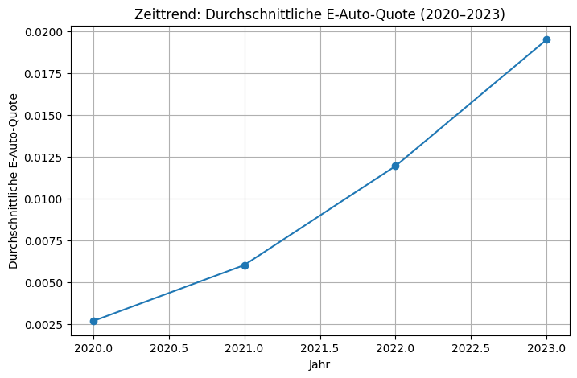
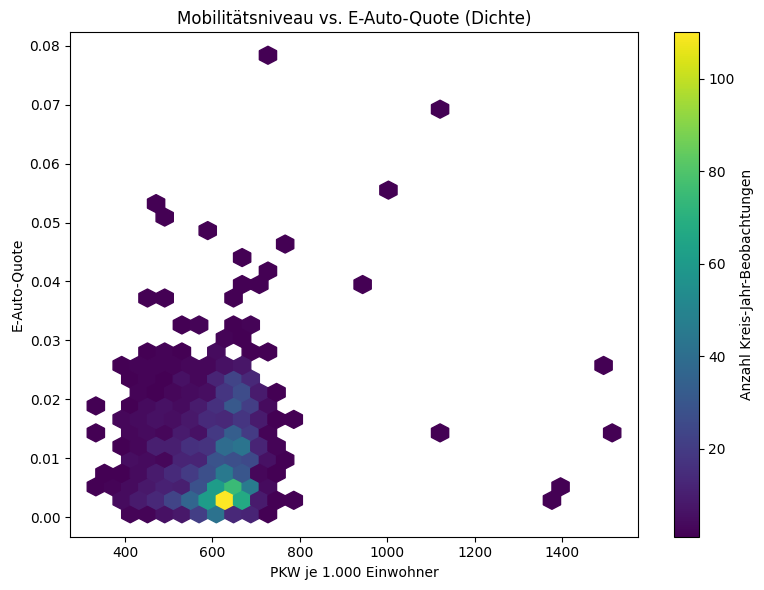
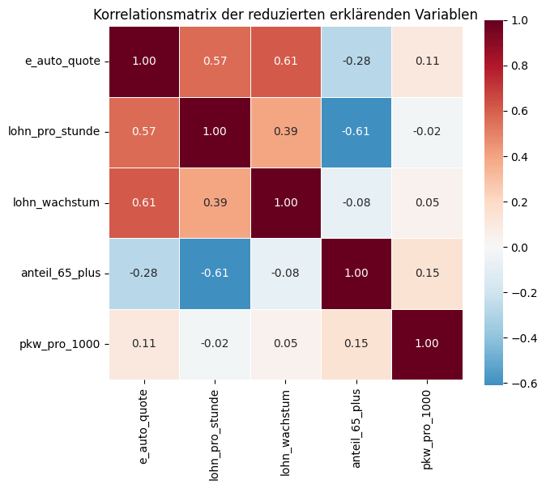
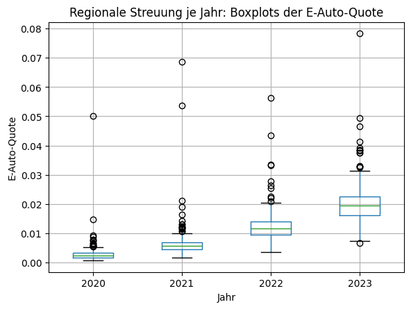
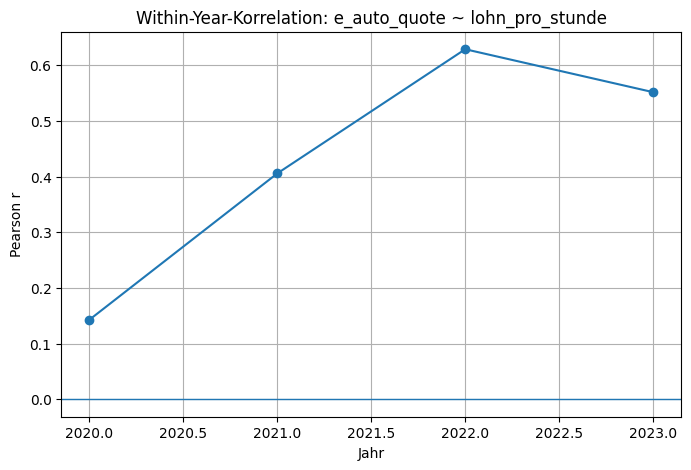
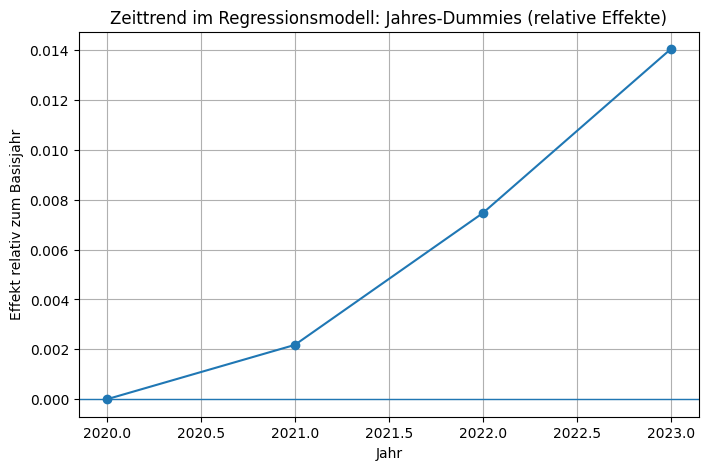

# Regionale Determinanten der E-Auto-Quote in Deutschland: Eine panelbasierte Analyse auf Kreisebene (2020–2023)

## 1. Einleitung

Diese Arbeit untersucht die Frage, welche sozioökonomischen und demografischen Faktoren mit der regionalen Verbreitung von Elektromobilität in Deutschland zusammenhängen. Im Fokus steht die E-Auto-Quote auf Kreisebene und deren Variation über Raum und Zeit. Die Motivation ergibt sich aus der schnellen Zunahme der E-Auto-Quote, der beobachtbaren regionalen Unterschiede sowie der Annahme, dass soziale und wirtschaftliche Strukturen die Adoption neuer Technologien systematisch beeinflussen.

Methodisch basiert die Untersuchung auf einem panelstrukturierten Datensatz auf Kreisebene (Kreis × Jahr), der amtliche Pkw-Bestandsdaten, volkswirtschaftliche Gesamtrechnungen und Bevölkerungsstatistiken kombiniert. Die Analyse folgt einem explorativ-quantitativen Ansatz mit deskriptiven Darstellungen, bivariaten Korrelationen, partiellen Korrelationen und linearen Regressionen, ergänzt um eine explizite Zeitdimension.

## 2. Daten und Variablen

### 2.1 Datensätze und Panelstruktur

Die Analyse kombiniert drei zentrale Datendomänen: (1) Pkw-Bestandsdaten zur Berechnung der E-Auto-Quote, (2) volkswirtschaftliche Gesamtrechnungen zur Abbildung ökonomischer Dimensionen sowie (3) Bevölkerungsdaten zur demografischen Struktur. Alle Datensätze werden über die gemeinsamen Schlüssel `kreis_id` und `jahr` zusammengeführt und zu einem (unbalancierten) Panel auf Kreisebene aggregiert. Die Einheit der Analyse ist damit der Landkreis in einem bestimmten Jahr.

### 2.2 Zielvariable: E-Auto-Quote

Die E-Auto-Quote ist der Anteil elektrisch betriebener Pkw am gesamten Pkw-Bestand eines Kreises in einem Jahr. Diese Operationalisierung ermöglicht den Vergleich zwischen unterschiedlich großen Regionen und bildet die Marktdurchdringung von Elektromobilität ab.

### 2.3 Latente Dimensionen und Operationalisierung

Die Variablen werden entlang theoretisch begründeter latenter Dimensionen aufbereitet:

- Einkommensniveau: Lohn- und Entgeltkennzahlen pro Arbeitsstunde
- Wirtschaftsstruktur (Beschäftigung): sektorale Beschäftigtenanteile
- Arbeitsintensität: Arbeitsstunden pro Beschäftigten
- Dynamik: Lohnwachstum gegenüber dem Vorjahr
- Demografie: Anteile der Bevölkerung 18–35 Jahre bzw. 65+
- Mobilitätsniveau: Pkw pro 1.000 Einwohner

<table style="width:100%; border-collapse: collapse;">
  <tr>
    <td style="width:50%; padding:10px; text-align:center;">
      
    </td>
    <td style="width:50%; padding:10px; text-align:center;">
      
    </td>
  </tr>
  <tr>
    <td style="padding:10px; text-align:center;">
      
    </td>
    <td style="padding:10px; text-align:center;">
      
    </td>
  </tr>
  <tr>
    <td style="padding:10px; text-align:center;">
      
    </td>
    <td style="padding:10px; text-align:center;">
      
    </td>
  </tr>
  <tr>
    <td style="padding:10px; text-align:center;">
      
    </td>
    <td style="padding:10px; text-align:center;">
      
    </td>
  </tr>
</table>

Abb. X: Choroplethen zur regionalen Verteilung zentraler Struktur-, Mobilitäts- und Demografievariablen im jeweils letzten verfügbaren Jahr.

Die Diagnostik zeigt für mehrere Variablen sehr hohe Missingness. Aufgrund dieser Datenlücken werden entsprechende Variablen aus weiterführenden Analysen ausgeschlossen.

**Tabelle 1.** Übersicht über Missingness und Variablenausschlüsse.  
(siehe 01Notebook; Tabelle hier optional ergänzen)

## 3. Deskriptive Analyse
## 3. Deskriptive Analyse

### 3.1 Räumliche Verteilung

Die räumlichen Muster werden durch Choroplethen für die E-Auto-Quote und zentrale Strukturvariablen des jeweils letzten verfügbaren Jahres visualisiert. Abbildung 1a zeigt die regionale Verteilung der E-Auto-Quote, Abbildung 1b das Mobilitätsniveau (`pkw_pro_1000`), Abbildung 1c–1d das Einkommensniveau (`lohn_pro_stunde`, `entgelt_pro_stunde`), Abbildung 1e–1g die Beschäftigungsstruktur (Dienstleistungen, produzierendes Gewerbe, verarbeitendes Gewerbe), Abbildung 1h die Arbeitsintensität, Abbildung 1i die ökonomische Dynamik (`lohn_wachstum`) sowie Abbildung 1j–1k die demografische Struktur (Anteil 18–35 bzw. 65+). Jede Karte dient der Identifikation räumlicher Cluster und zeigt, in welchen Regionen systematische Ausprägungen der jeweiligen Dimensionen vorliegen. [Abbildung 1a–1k hier einfügen]

### 3.2 Verteilung der E-Auto-Quote

Die Verteilung der E-Auto-Quote über alle Kreise und Jahre ist in Abbildung 2 als Boxplot dargestellt. Die Grafik dient der Einschätzung der Streuung und zeigt, dass die E-Auto-Quote deutlich heterogen über den gesamten Beobachtungszeitraum verteilt ist. [Abbildung 2 hier einfügen]

**Abbildung 2.** Entwicklung der durchschnittlichen E-Auto-Quote im Zeitraum 2020–2023.
### 3.3 Erste bivariate Muster in der Deskription

Zur Illustration des Zusammenhangs zwischen Mobilitätsniveau und E-Auto-Quote wird eine Dichtegrafik (Hexbin) genutzt (Abbildung 3). Die Grafik reduziert Overplotting und verdeutlicht, in welchen Bereichen der Pkw-Dichte die meisten Kreis-Jahr-Beobachtungen liegen. [Abbildung 3 hier einfügen]

**Abbildung 3.** Zusammenhang zwischen Pkw-Bestand pro 1.000 Einwohner und E-Auto-Quote (Hexbin-Darstellung).

## 4. Bivariate Analyse
Die bivariaten Zusammenhänge zwischen E-Auto-Quote und erklärenden Variablen sind in Tabelle 2 dokumentiert. Die Korrelationen werden dimensionsweise berichtet und ausschließlich als lineare Zusammenhänge interpretiert.

- **Ökonomische Dynamik:** Lohnwachstum weist den stärksten positiven Zusammenhang auf (r = 0.6108, p < 0.001).
- **Einkommensniveau:** Lohn pro Arbeitsstunde (r = 0.5668, p < 0.001) und Entgelt pro Arbeitsstunde (r = 0.5573, p < 0.001) zeigen starke positive Zusammenhänge.
- **Demografie:** Der Anteil 65+ korreliert moderat negativ (r = −0.2760, p < 0.001), der Anteil 18–35 moderat positiv (r = 0.2371, p < 0.001).
- **Mobilitätsniveau:** Pkw pro 1.000 Einwohner zeigt einen schwachen, aber signifikanten positiven Zusammenhang (r = 0.1107, p < 0.001).
- **Wirtschaftsstruktur:** Dienstleistungsanteil ist schwach positiv (r = 0.0714), produzierendes Gewerbe schwach negativ (r = −0.0515), verarbeitendes Gewerbe nicht signifikant.
- **Arbeitsintensität:** Kein signifikanter Zusammenhang (r = 0.0443, p > 0.05).

Die vollständigen bivariaten Ergebnisse sind in Tabelle 2 zusammengefasst. [Tabelle 2 hier einfügen]

Ergänzend verdeutlicht Abbildung 4 (LOWESS) die positive Beziehung zwischen Lohn pro Arbeitsstunde und E-Auto-Quote, während Abbildung 5 (Hexbin) den Zusammenhang zwischen Lohnwachstum und E-Auto-Quote abbildet. Abbildung 6 (gebinnte Mittelwerte) zeigt, wie die E-Auto-Quote mit dem Anteil der Bevölkerung 65+ abnimmt. Diese Grafiken dienen der visuellen Prüfung linearer und nichtlinearer Muster sowie der Stabilität der bivariaten Beziehungen. [Abbildung 4–6 hier einfügen]

Die vollständigen bivariaten Ergebnisse sind in Tabelle 2 zusammengefasst.

**Tabelle 2.** Bivariate Korrelationen mit der E-Auto-Quote.

| Dimension        | Variable          | r      | p      |
|-----------------|-------------------|--------|--------|
| Einkommensniveau | Lohn pro Stunde   | 0.567  | < .001 |
| Einkommensniveau | Entgelt pro Stunde| 0.557  | < .001 |
| Dynamik          | Lohnwachstum      | 0.611  | < .001 |
| Demografie       | Anteil 65+        | -0.276 | < .001 |
| Demografie       | Anteil 18–35      | 0.237  | < .001 |
| Mobilitätsniveau | PKW/1000          | 0.111  | < .001 |

.png)

**Abbildung 4.** Zusammenhang zwischen Lohn pro Arbeitsstunde und E-Auto-Quote (LOWESS).

.png)

**Abbildung 5.** Zusammenhang zwischen Lohnwachstum und E-Auto-Quote (Hexbin).

.png)

**Abbildung 6.** Zusammenhang zwischen Anteil der Bevölkerung 65+ und E-Auto-Quote.

## 5. Multivariate Analyse

### 5.1 Partielle Korrelationen

Unter Kontrolle der Altersstruktur (Anteil 65+) bleiben die Zusammenhänge zwischen E-Auto-Quote und den zentralen ökonomischen Variablen bestehen. Die partiellen Korrelationen betragen r = 0.551 (p < 0.001) für `lohn_pro_stunde` und r = 0.620 (p < 0.001) für `lohn_wachstum`. Dies deutet darauf hin, dass beide ökonomischen Dimensionen unabhängig von der Altersstruktur mit der E-Auto-Quote verbunden sind.

### 5.2 Lineare Regressionen

Die multivariate Basisregression (Tabelle 3) modelliert die E-Auto-Quote als Funktion von Lohn pro Arbeitsstunde, Lohnwachstum und Anteil 65+. Das Modell erklärt 53,8 % der Varianz (R² = 0.538). Die Koeffizienten sind positiv für Einkommensniveau (β = 0.0008, p < 0.001) und Dynamik (β = 0.0015, p < 0.001), während der demografische Anteil 65+ negativ und nicht signifikant ist (β = −0.0094, p = 0.111). [Tabelle 3 hier einfügen]

Zur Einschätzung relativer Effektstärken wurde eine standardisierte Regression geschätzt (Tabelle 4). Die standardisierten Koeffizienten zeigen einen stärkeren Effekt für Lohnwachstum (β = 0.4456) als für Lohn pro Arbeitsstunde (β = 0.4139), während der Effekt von Anteil 65+ klein und nicht signifikant bleibt (β = −0.0384, p = 0.111). 

**Tabelle 3.** Lineare Basisregression (ohne Zeitkontrolle).  
(Regressionstabelle aus Notebook einfügen)

**Tabelle 4.** Standardisierte Koeffizienten.  
(optional)
### 5.3 Reduzierte Variablen und Korrelationen

Zur Kontrolle von Multikollinearität und Redundanz wird ein reduziertes Variablenset genutzt (E-Auto-Quote, Lohn pro Stunde, Lohnwachstum, Anteil 65+, Pkw pro 1.000 Einwohner). Abbildung 7 zeigt die Korrelationsmatrix dieser reduzierten Variablen und dient der Kontrolle von Zusammenhängen zwischen den Prädiktoren. [Abbildung 7 hier einfügen]

## 6. Zeitdimension

### 6.1 Datenabdeckung und Zeittrend

Die Jahresabdeckung des Panels beträgt jeweils 476 Beobachtungen pro Jahr (2020–2023). Für Modelle mit vollständigen Fällen reduziert sich die Stichprobe auf 151 (2020), 389 (2021), 397 (2022) und 395 (2023). Diese Verteilungen sind in Tabelle 5 dokumentiert. [Tabelle 5 hier einfügen]

Die durchschnittliche E-Auto-Quote steigt kontinuierlich von 0.002688 (2020) auf 0.019508 (2023). Die jährlichen Mittelwerte, Mediane und Streuungen sind in Tabelle 6 aufgeführt; der zugehörige Zeittrend ist in Abbildung 8 visualisiert. [Tabelle 6 hier einfügen] [Abbildung 8 hier einfügen]

**Abbildung 8.** Zeitlicher Trend der durchschnittlichen E-Auto-Quote.

### 6.2 Regionale Streuung pro Jahr

Abbildung 9 zeigt Boxplots der E-Auto-Quote getrennt nach Jahr. Diese Grafik illustriert, dass die regionale Streuung auch innerhalb einzelner Jahre hoch bleibt und somit nicht allein durch den allgemeinen Zeittrend erklärbar ist. [Abbildung 9 hier einfügen]

**Abbildung 9.** Regionale Streuung der E-Auto-Quote (Boxplots).
### 6.3 Mobilitätsniveau im Zeitkontext

Der Hexbin-Plot in Abbildung 10 stellt die Beziehung zwischen Pkw-Dichte und E-Auto-Quote erneut dar, nun im Rahmen der Zeitdimension. Die Grafik dient dazu, die Dichteverteilung der Beobachtungen im kombinierten Zeitfenster zu veranschaulichen und mögliche Veränderungen in der Streuung sichtbar zu machen. [Abbildung 10 hier einfügen]

### 6.4 Within-Year-Korrelationen

Die Within-Year-Korrelationen zwischen E-Auto-Quote und Lohn pro Arbeitsstunde variieren über die Zeit: r = 0.1429 (2020), r = 0.4057 (2021), r = 0.6288 (2022) und r = 0.5516 (2023). Die Werte sind in Tabelle 7 dokumentiert und in Abbildung 11 visualisiert. [Tabelle 7 hier einfügen] [Abbildung 11 hier einfügen]

### 6.5 Regression mit Jahres-Dummies

Die Regression mit Jahres-Dummies (Tabelle 8) zeigt deutlich positive Jahreseffekte gegenüber 2020: 2021 (β = 0.0022), 2022 (β = 0.0075) und 2023 (β = 0.0140), jeweils hochsignifikant. Der Einkommenseffekt bleibt positiv (β = 0.0005, p < 0.001), während Lohnwachstum unter Zeitkontrolle nicht signifikant ist (β = 0.000078, p = 0.330). Der Anteil 65+ ist signifikant negativ (β = −0.0425, p < 0.001). [Tabelle 8 hier einfügen]

Abbildung 12 visualisiert die geschätzten Jahres-Dummies als relative Effekte gegenüber dem Basisjahr 2020 und macht den zeitlichen Diffusionstrend sichtbar. [Abbildung 12 hier einfügen]

**Abbildung 12.** Regressionsergebnisse mit Zeitkontrolle (Basisjahr 2020).

## 7. Diskussion

Die Ergebnisse zeigen ein konsistentes Muster: Die E-Auto-Quote ist stark zeitlich getrieben, jedoch in jeder Phase durch regionale Strukturunterschiede geprägt. Der Einkommenseffekt bleibt in allen Modellen stabil positiv; demgegenüber verliert ökonomische Dynamik im Zeitmodell ihre eigenständige Erklärungskraft. Der negative Effekt einer älteren Bevölkerungsstruktur wird in der Zeitregression deutlich und bleibt trotz Kontrolle ökonomischer Faktoren erhalten.

Die Befunde sprechen für eine Kombination aus Diffusion (zeitlicher Trend) und sozialer Differenzierung (strukturbedingte Unterschiede). Innerhalb der Jahre steigen die Korrelationen zwischen Einkommensniveau und E-Auto-Quote deutlich an, was auf eine zunehmende soziale Selektivität der Elektromobilität im Zeitverlauf hindeutet. Gleichzeitig bleibt die regionale Streuung hoch, sodass die Diffusion nicht zu einer vollständigen Angleichung führt.

Grenzen der Analyse liegen in der explorativen, nicht-kausalen Ausrichtung sowie in der unbalancierten Panelstruktur. Die Ergebnisse beschreiben Zusammenhänge, können jedoch keine Ursache-Wirkungs-Beziehungen belegen. Auch verbleibende Datenlücken (Missingness) und die Nutzung demografischer Strukturdaten aus einem Jahr als zeitlich stabile Größen begrenzen die Interpretation.

## 8. Fazit

Die Forschungsfrage nach sozioökonomischen und demografischen Determinanten der E-Auto-Quote lässt sich wie folgt beantworten: Die regionale Verbreitung von Elektromobilität hängt stark mit dem Einkommensniveau zusammen, während ökonomische Dynamik nur im bivariaten Kontext relevant ist. Eine ältere Bevölkerungsstruktur wirkt hemmend, und diese Wirkung bleibt auch unter Zeitkontrolle bestehen. Der Zeittrend ist stark und erklärt einen erheblichen Teil der Zunahme der E-Auto-Quote, die regionalen Unterschiede bleiben jedoch ausgeprägt.

Zentrale empirische Befunde sind der kontinuierliche Zeittrend, die hohe Erklärungskraft der multivariaten Modelle sowie die zunehmende Stärke des Einkommenszusammenhangs innerhalb der Jahre. Ein Ausblick für weitere Forschung besteht in der Erweiterung um infrastrukturelle Variablen, einer feineren Zeitauflösung sowie der Nutzung kausaler Designs, um Diffusion und soziale Selektivität noch präziser zu trennen.

